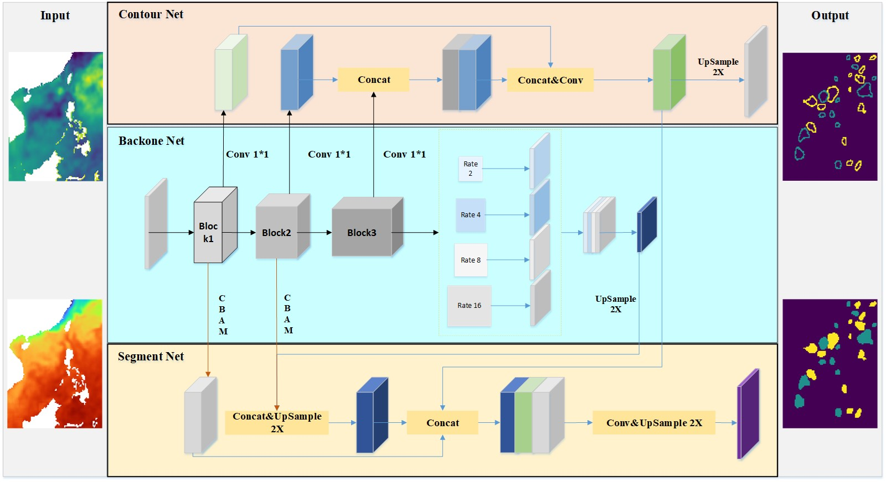
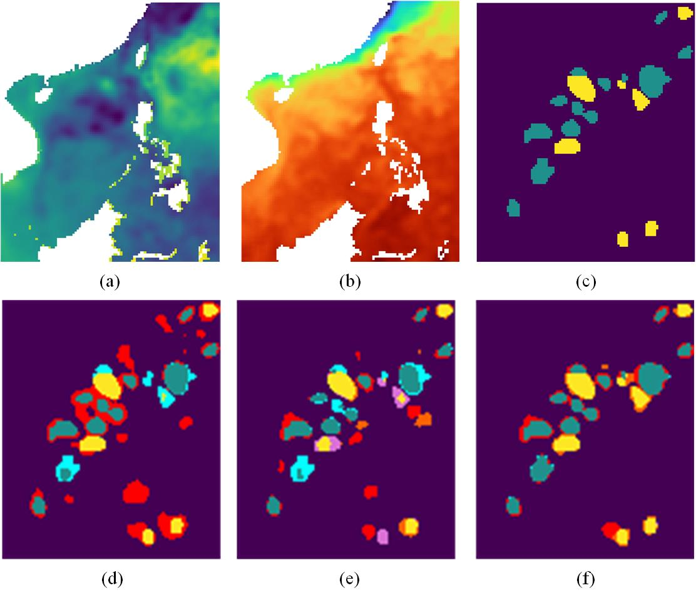
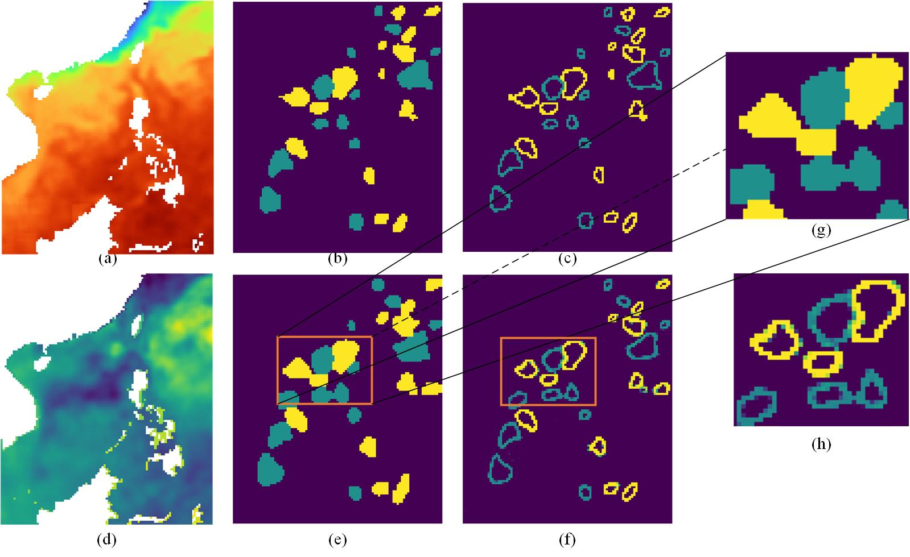

### Resources
- Implementation of **MFDE** (Mesoscale eddy detection based on multi-feature fusion network) 

### Datasets 
1. SSH data: [ADT Dataset ](https://data.marine.copernicus.eu/products))

2. SST:  [[SST Dataset ](https://psl.noaa.gov/data/gridded/data.noaa.oisst.v2.highres.html)]

3. Our data(SSH,SST and Contour data): [[Google Drive](https://drive.google.com/drive/folders/15RsEpo9WsvZYQ0KB756dg5G4ORsY27Eg?usp=drive_link)]

4. Best_model:[[Google Drive](https://drive.google.com/file/d/1xQQEq1BaOtihsUWqsV3XLQ31EhoVM8Ep/view?usp=drive_link)]
### Usage
- Download the data, setup data-paths in the datasets
- Use the training scripts[train.py] for paired training of MFED

| The Overall Flowchart of the Proposed Architecture |
|:---------------------------------------------------|
|                         |

| Mesoscale eddy semantic segmentation task |
|:------------------------------------------|
|                |

| Mesoscale eddy contours detection task |
|:---------------------------------------|
|             |

### Acknowledgements

